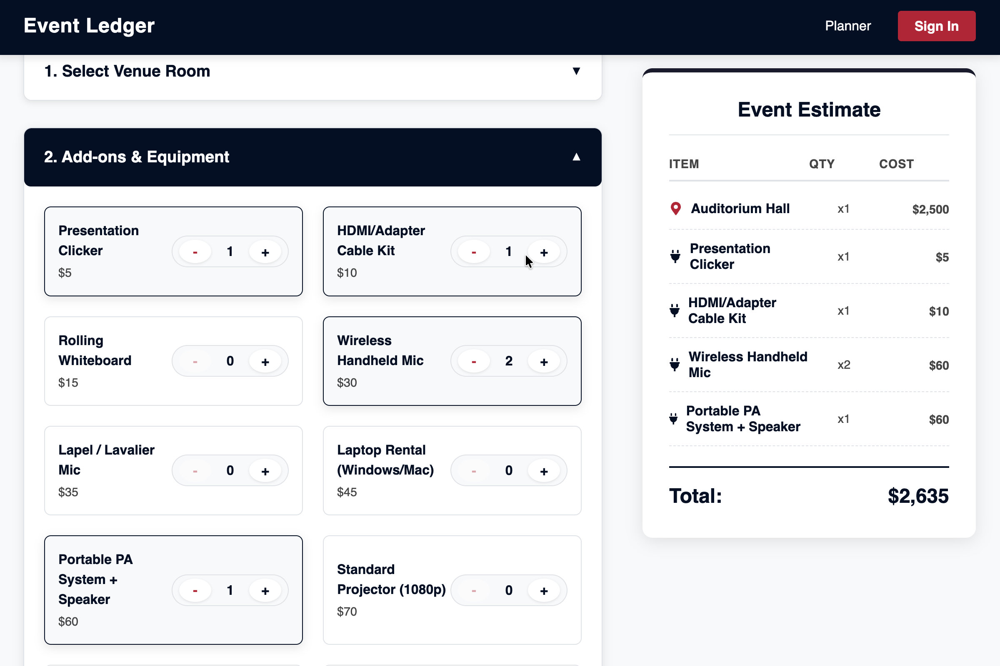

# Event Ledger
A small full-stack project built with **React** and **Django REST Framework**.  
The app lets users browse event resources (venues, A/V items, meals), add them to a cart, and see a running total.  


## Table of Contents
- [Overview](#overview)
- [Features](#features)
- [Backend Setup](#backend-setup)
- [Frontend Setup](#frontend-setup)
- [Architecture](#architecture)

---

## Overview

This project is a simple example of a decoupled React + Django setup.  
React handles the UI and state, while Django exposes a small REST API. Redux Toolkit is used mainly for organizing selected items and calculating totals.

A small seeding script (`load_data.py`) is included so the backend has sample data immediately after setup.


---

## Features

- React frontend communicating with a Django REST API  
- Redux Toolkit for lightweight state management  
- Real-time total cost calculation as items are added or removed  
- Simple “offline mode” fallback using local JSON data if the API isn’t reachable  
- Small database seeding script for quick setup  
- Clean folder structure on both frontend and backend



---

## Backend Setup

1. Open a terminal and navigate into the backend folder:
    ```bash
    cd backend
    ```

2. Create and activate a virtual environment:

    **macOS / Linux**
    ```bash
    python3 -m venv venv
    source venv/bin/activate
    ```

    **Windows**
    ```bash
    python -m venv venv
    venv\Scripts\activate
    ```

3. Install project dependencies:
    ```bash
    pip install -r requirements.txt
    ```

4. Apply migrations and load example data:
    ```bash
    python manage.py migrate
    python scripts/load_data.py
    ```

5. Start the Django development server:
    ```bash
    python manage.py runserver
    ```

The backend will be running at: http://127.0.0.1:8000/

---

## Frontend Setup

1. Open a new terminal and navigate into the frontend folder:
    ```bash
    cd frontend
    ```

2. Install required packages:
    ```bash
    npm install
    ```

3. Start the React development server:
    ```bash
    npm run dev
    ```

The frontend will be running at: http://localhost:5173/

---

## Architecture

This project follows modern full-stack engineering patterns:

### Frontend (React)
- **UI Layer** (pages, components)
- **Service Layer** (API utilities)
- **State Layer** (Redux slices for resources and cart)
- **Routing Layer** (`react-router-dom` for SPA routing)

### Backend (Django REST Framework)
- **Models**: Venue, Meal, AV Equipment
- **Serializers**: Conversion to/from JSON
- **Views / Endpoints**: REST API for resources
- **Scripts**: Local data seeding using Django ORM

This structure allows both sides to evolve independently while maintaining a clean API contract.
